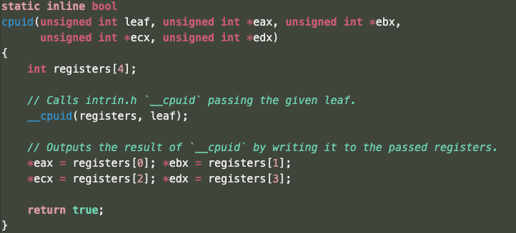

_As of 2022-06-08 [GitHub is sunsetting the Atom editor][1]._

# [Giulio Procopio][2]'s Atom Retro Syntax Theme

<p align="center">
    
</p>

This is essentially vendored from [Melina Donati's][3] [90s-tshirt-syntax][4],
however some things didn't sound like they were right.  For example, reducing
font size of comments causes columns missaligning and preferred line length
basically blows up.

[1]: https://github.blog/2022-06-08-sunsetting-atom/
[2]: https://github.com/giulioprocopio
[3]: https://github.com/melinadonati
[4]: https://github.com/melinadonati/90s-tshirt-syntax

## Installation
You may both use Atom graphical package manager and `apm` for installation.
```bash
apm install https://github.com/giulioprocopio/retro-syntax.git
```
Check out also [atom.io][5] for installation.

[5]: https://atom.io/packages/retro-syntax
